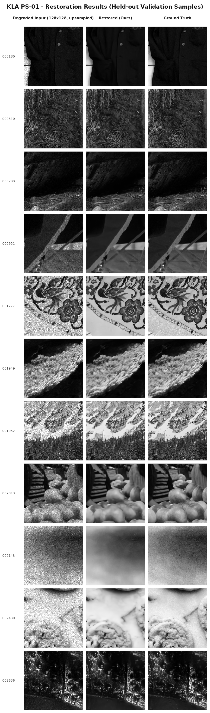

# KLA PS-01 — AI-Based Restoration of Degraded Images

> Measure the degradation, then invert it. A 3.74M-parameter CNN recovers KLA's forward
> model from the paired data by least squares, stabilises its signal-dependent noise with
> a variance-stabilising transform, and inverts it.

## Table of Contents

- [Results](#results)
- [Setup](#setup)
- [Inference (What the Evaluator Runs)](#inference-what-the-evaluator-runs)
- [Reproduce Training](#reproduce-training)
- [Method](#method)
- [Runtime](#runtime)
- [Repository Layout](#repository-layout)
- [Environment](#environment)
- [External Resources](#external-resources)
- [References](#references)

## Results

256 held-out validation images, EMA weights, outputs clipped to `[0,1]`.

<p align="center">
  
</p>
<p align="center"><em>Degraded input vs. restored output vs. ground truth on held-out validation samples.</em></p>

| Method | Params | SE | PSNR | SSIM (Wang 11x11) | SSIM (skimage default) | LPIPS |
|---|---|---|---|---|---|---|
| Bilinear x2 (baseline) | 0.000 M | 1 | 24.747 | 0.6147 | 0.6059 | 0.3878 |
| Bicubic x2 (baseline) | 0.000 M | 1 | 23.003 | 0.5535 | 0.5476 | 0.4377 |
| Ours (res 96x20, VST=on, DC=on) | 3.740 M | 1 | 28.536 | 0.7860 | 0.7813 | 0.2545 |
| Ours (res 96x20, VST=on, DC=on) | 3.740 M | 4 | 28.567 | 0.7869 | 0.7822 | 0.2559 |
| Ours (res 96x20, VST=on, DC=on) | 3.740 M | 8 | 28.573 | 0.7870 | 0.7823 | 0.2560 |

Two SSIM variants are reported because they are different numbers on the same images:
the Wang et al. 11x11 Gaussian standard (which our SSIM loss optimises and which the
restoration literature reports) and scikit-image's default 7x7 uniform window. LPIPS is
real LPIPS (AlexNet backbone); if the package is unavailable it is reported as `nan` and
never silently replaced by a different formula.

### OOD Robustness — Axis 1: Parameter Shift

Noise levels never calibrated on:

| Sigma Multiplier | PSNR | SSIM | LPIPS |
|---|---|---|---|
| 0.70x | 29.975 | 0.7993 | 0.2923 |
| 0.85x | 29.440 | 0.7892 | 0.2930 |
| 1.00x | 28.924 | 0.7782 | 0.2980 |
| 1.20x | 28.306 | 0.7642 | 0.3061 |
| 1.40x | 27.618 | 0.7477 | 0.2791 |

### OOD Robustness — Axis 2: Operator Shift

A different resampling kernel entirely:

| Kernel | PSNR | SSIM | LPIPS |
|---|---|---|---|
| Measured (calibrated) | 28.924 | 0.7782 | 0.2980 |
| Box / area-average 2x2 | 28.553 | 0.7652 | 0.3297 |
| Bicubic, no anti-alias | 29.052 | 0.7852 | 0.2820 |

## Setup

```bash
python -m venv .venv && source .venv/bin/activate
pip install -r requirements.txt
```

## Inference (What the Evaluator Runs)

```bash
python inference.py --input_dir /path/to/degraded --output_dir /path/to/restored
```

- Accepts `.npy` (float32, may fall outside `[0,1]`) and `.png`/`.tif`.
- Writes `<name>.npy` (float32, scored artifact) **and** `<name>.png` (16-bit preview)
  into `--output_dir/png/`.
- Filenames are preserved. Any even or odd image size works (128→256 and 256→512 both
  restore with this one checkpoint).
- Weights default to `weights/model.pt`; no source edits are required.

**Useful flags:** `--batch_size 16`, `--self_ensemble {1,4,8}` (quality/throughput dial),
`--device cpu`, `--fp32`, `--no_png`.

## Reproduce Training

```bash
python train.py --data_dir /path/to/train --out_dir runs/repro
```

`data_dir` must contain `GT/` and `NoisyLR/` with matching `.npy` filenames.

## Method

1. **Forward-model identification.** The three degradations are applied in an undisclosed
   order, but speckle is mean-1 multiplicative, Gaussian noise is mean-0 additive, and
   downsampling is linear, so `E[LR|GT] = D(GT)` for every ordering. `D` is therefore
   recovered by ordinary least squares — a full 6x6 kernel (sum = 1.0000), matching
   neither box nor bicubic. The residual variance is regressed on intensity to give
   `Var = sg^2 + ss^2 * mu^2` (sg = 0.03324, ss = 0.16055, R2 = 0.9868), and the residual
   autocorrelation gives the fraction of noise variance injected upstream of the
   resampler, beta = 0.402.
2. **Variance stabilisation.** `f(x) = asinh(ss*x/sg)/ss` follows from
   `f'(mu) = 1/sqrt(Var(mu))`. It is odd and finite on negatives, so the out-of-`[0,1]`
   NoisyLR values the problem statement calls intentional pass through losslessly.
3. **Architecture.** VST → stem → 20 x (res block + ECA) → PixelShuffle x2 →
   zero-initialised tail added to a bilinear skip, so step 0 is exactly the bilinear
   baseline. A zero-initialised data-consistency head feeds back the measurement
   residual `y - D(x_hat)` (one step of algorithm unrolling, Monga et al. 2021).
4. **Supervision.** Half of every batch is real pairs, half is GT re-degraded on the fly
   with the measured operator, randomised around the measurement (sigma ±0.28
   log-uniform, beta ±0.12, kernel ±0.05) for out-of-distribution robustness.
5. **Losses.** Charbonnier 1.0 + 0.15 (1 − SSIM) + 0.05 FFT-amplitude L1, with LPIPS
   weight 0.05 ramped in for the final 15% of the budget. Every term is evaluated in fp32.

## Runtime

End-to-end as defined by the official document (disk read → preprocess → H2D → model →
D2H → post-process → save), CUDA-synchronised at both ends, 2 warm-up passes discarded:

**17.56 ms/image (57 img/s)** at batch 16, SE=1, on Tesla T4. Scoring runs on an H100,
which is materially faster. Inference is single-GPU by design: DataParallel measured
*slower* for this model size.

## Repository Layout

```text
README.md  requirements.txt  train.py  inference.py
configs/   config.json, calibration.json
src/       kla_core.py      <- shared by the notebook, train.py and inference.py
weights/   model.pt
results/   metrics, curves, gallery, restored_val/ (.npy + .png)
```

`inference.py` is generated by concatenating `src/kla_core.py` with a CLI, so the trained
function and the scored function are the same source by construction. The notebook
asserts numerical parity between them before this repository is written.

## Environment

python 3.12.13 · torch 2.10.0+cu128 · cuda 12.8 · numpy 2.0.2 ·
trained on 2 x Tesla T4 · seed 1337

## External Resources

Training used **only** the KLA-provided paired dataset. No pretrained weights are used
in the submitted model. LPIPS (AlexNet backbone, Zhang et al. 2018, BSD-3) is used **for
evaluation and as an optional late-phase loss only**.

## References

- Chen et al., *Simple Baselines for Image Restoration* (NAFNet), ECCV 2022.
- Lim et al., *Enhanced Deep Residual Networks for Single Image Super-Resolution* (EDSR), CVPRW 2017.
- Wang et al., *ECA-Net: Efficient Channel Attention*, CVPR 2020.
- Monga et al., *Algorithm Unrolling*, IEEE Signal Processing Magazine 38(2), 2021.
- Zhang et al., *The Unreasonable Effectiveness of Deep Features as a Perceptual Metric* (LPIPS), CVPR 2018.
- Zhai et al., *A Comprehensive Review of Deep Learning-Based Real-World Image Restoration*, IEEE Access 11, 2023.
# Pixel_Alchemists
